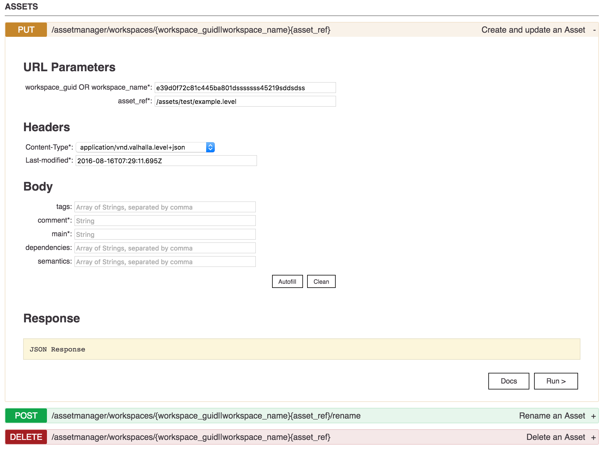

**[Home](Home)**

### Overview
The Bilrost API UI is a tool for developers to test, study and get inspired on how to use the Bilrost API calls. It lists all possible REST requests, and gives the user the option to change any relevant parameters on the URL, request body or headers.

Since the purpose of this API UI is to test, educate and inspire developers, no input validation is made on the view. Testing errors and seeing responses to incorrect inputs is useful in this case.

### How to run
To access the Bilrost API UI, the user needs to run "node proxy.js" on the fl4re-ui/src/server folder. The API UI will then be accessible at http://localhost:9224/api-ui/index.html.

The Bilrost API UI main page leads into two sub-pages, one that gives access to testing the Content Browser's API calls (http://localhost:9224/api-ui/cb.html) and another one for the Asset Manager's (http://localhost:9224/api-ui/am.html). Each page contains a list of various API calls that can be set up as the user intends.*

### Button Descriptions
- The "Autofill" button fills fields with the example data shown as a placeholder;
- The "Clean" button just removes contents from all fields;
- The "Docs" button takes the user to the documentation of that specific API call;
- The "Run >" button runs the API call.

### Workspaces
Most calls require the user to have a valid workspace added to their favorite list, through the Workspaces' PUT method. You should point at a valid workspace folder starting with "file:///", and that folder must contain a ".bilrost" folder with assets.

You can see an example of API call below (in this case, it shows the GET request for a specific Workspace's highest priority Status.

### Github Login
To access calls related to projects hosted remotely (all calls using Organization, Project or Project Full Name), you must perform a github login, using the button on the top of either of the API UI pages.
